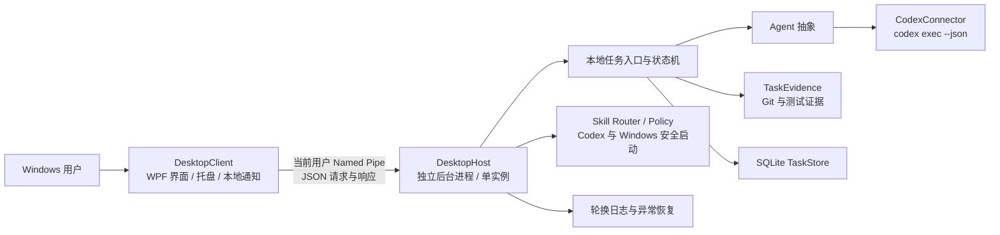

# ScreenGuide Desktop V0.1 发布报告

发布日期：2026-08-18
版本：0.1.0
目标平台：Windows x64
结论：桌面端 V0.1 已完成产品化，并增加 V0.2 第一组低风险桌面能力：逐次确认后打开受控应用或 `https` 网站。自动化测试、真实 Codex、真实 Windows 启动和安装生命周期均已验收。本报告不代表手机端、云端、远程桌面、桌面视频或完整语音能力已经实现。

## 1. 最终架构



架构边界已经固定：

- `DesktopClient` 只调用 `ScreenGuide.DesktopProtocol`，不引用 Codex Connector、Evidence 或 Persistence。
- `DesktopHost` 是独立后台进程。关闭或崩溃 UI 不会结束正在由 Host 管理的任务。
- IPC 使用异步 Named Pipe，服务端启用 `PipeOptions.CurrentUserOnly`，只允许当前 Windows 用户会话连接。
- Host 和 Client 均为当前用户单实例；第二次启动 Client 会唤醒已有窗口。
- Host 负责项目授权、任务命令、状态机、取消、Codex 生命周期、证据、SQLite、审计和恢复。
- Windows 安全启动也只由 Host 执行；Client 不直接启动应用或浏览器。每次操作使用一次性命令授权并记录审计。
- SQLite、日志、证据基线和设置保存在当前用户的 LocalAppData，程序文件与用户数据分离。
- Host 重启时不重放旧指令；未完成任务进入 `Interrupted`，保留已有 Thread ID 和证据。

## 2. DesktopClient 与 DesktopHost 通信

`ScreenGuide.DesktopProtocol` 提供稳定的本地应用服务契约和 DTO。当前协议覆盖：

- Host 心跳、系统状态和关闭；
- Dashboard 汇总；
- 项目列表、添加授权、删除授权；
- 任务创建、列表、详情、取消和续接；
- Evidence、事件、Attempt、Codex 诊断和 Device 信息；
- 设置页需要的数据目录、数据库状态和版本状态。
- 受控应用清单，以及需要显式确认的应用/网站一次性启动请求。

Client 每次调用建立短连接并设置超时。Host 离线时 UI 显示普通用户可理解的离线状态；Client 会在安全边界内尝试启动本机 Host，Host 恢复后可重新连接。该 Named Pipe 不是网络 API，也不会暴露给局域网或互联网。

## 3. 用户功能

### 首页

- 显示 Host、Codex、版本兼容、当前任务、等待决定、授权项目、今日完成和失败数量。
- 核心输入区使用“今天想让电脑帮你做什么？”。
- 可选择已授权项目并创建任务。

### 项目

- 用户通过目录选择器明确添加项目，不扫描硬盘。
- 显示名称、路径、Git 状态、授权状态、最近任务和是否正在执行。
- 支持删除授权；未授权目录不能启动任务。

### 当前任务与历史

- 实时显示状态、时间、持续时间、Attempt、事件时间线和当前执行内容。
- 支持真实取消。
- `WaitingForUser` 显示决策卡，回答后继续原 Thread，不创建第二个任务。
- 历史支持成功、失败、已取消、未验证、验证失败和等待用户等筛选。

### 可信结果

- 结果页优先显示 `VerificationStatus`，不把 Agent 自述当成验证结论。
- 显示 `UserSummary`、修改/新增/删除文件、diff 统计、测试命令、退出码、测试数量、最终说明和证据冲突标志。
- Codex 自述成功而测试失败时，明确提示“Codex 已完成执行，但系统验证未通过。”
- 没有真实测试证据时显示 `Unverified`，不会伪造“测试通过”。

### 首次启动、托盘、通知和设置

- 首次启动依次检查 Codex、添加第一个 Git 项目、确认示例任务；不会自动执行示例。
- 托盘显示空闲、工作中、等待决定和出错状态，并提供打开、新建任务、当前任务、取消、设置、退出。
- 关闭窗口可继续后台运行；退出产品会按设置关闭 UI，并由 Host 处理生命周期。
- 本地通知只发送任务完成、失败和等待决定，内容来自 `UserSummary`/Evidence；通知具有持久化去重键，点击路由到任务详情。
- 设置包含开机启动、后台运行、关闭到托盘、本地通知、数据位置、Codex/数据库/Device 状态、历史清理、日志目录和版本。

### 电脑操作

- 从内置受控清单打开文件资源管理器、记事本、计算器、画图或 Windows 设置。
- 打开用户明确输入并确认的 `https` 网站；拒绝 `http`、本地文件、脚本协议及包含账号信息的网址。
- 每次操作都显示准确目标并要求当次确认，授权不可重复使用。
- UI 只通过 Named Pipe 请求 Host；实际启动由 `windows.safe-launch` Skill Adapter 执行。
- 命令和成功/拒绝/失败结果写入 SQLite 审计；网址查询参数与片段不会进入持久化审计。
- 当前明确不提供任意程序路径、命令行、鼠标点击、键盘输入、发送消息、删除、付款或账号设置。

## 4. 错误与稳定性

已提供面向普通用户的错误映射，不直接展示异常堆栈。覆盖 Codex 未安装、版本不兼容、登录失效、启动失败、网络不可用、项目不存在、非 Git 项目、授权失效、Host 离线、SQLite 初始化失败、Codex 意外退出、任务中断、测试失败和证据不完整。

稳定性措施包括：

- Client/Host 单实例和 Host 离线重连；
- UI 崩溃与任务执行进程解耦；
- Host 启动恢复、无旧指令自动重放；
- Windows Job Object 进程树取消与退出清理；
- Windows 注销/关机生命周期处理；
- Evidence 过期基线和临时文件清理；
- 按日期/大小轮换日志；
- 日志、事件和错误中的敏感参数脱敏；
- SQLite 启动错误状态文件和用户可见诊断入口；
- 权威 `turn.completed`/`turn.failed` 事件门禁，进程退出不能单独产生 Completed；
- 等待决定事件到达后，先等待旧 Turn 进程树完全收尾，再允许立即续接，消除并发 Turn 竞态。

## 5. 项目结构

```text
src/
  ScreenGuide.DesktopClient/       Windows WPF 客户端、托盘、通知、onboarding
  ScreenGuide.DesktopProtocol/     当前用户 Named Pipe 契约与客户端
  ScreenGuide.DesktopHost/         独立后台 Host 与本地应用服务
  ScreenGuide.Agent.Abstractions/  Agent 中立接口
  ScreenGuide.Agent.Codex/         Codex CLI 封装和版本门禁
  ScreenGuide.Core/                任务模型、状态机和路径策略
  ScreenGuide.Persistence/         SQLite、取消和恢复
  ScreenGuide.Evidence/            Git、测试和结构化证据
  ScreenGuide.Skills.Abstractions/ 通用 Skill 执行契约
  ScreenGuide.Skills.Windows/      受控应用与 https 网站安全启动
tests/
  ScreenGuide.DesktopClient.Tests/
  ScreenGuide.DesktopHost.Tests/
  ScreenGuide.DesktopProduct.Tests/
  ScreenGuide.Agent.Codex.Tests/
  ScreenGuide.Tasking.Tests/
  ScreenGuide.Core.Tests/
  ScreenGuide.FakeCodexCli/
installer/                         Inno Setup、简体中文语言文件、数据删除工具
scripts/                           可重复发布和安装生命周期验收脚本
tools/ScreenGuide.DesktopV01.RealAcceptanceRunner/
                                    真实 Release 桌面流程验收工具
```

旧的角色化原型已经完成依赖审计并从解决方案、正式构建和工作树中移除。唯一迁移的通用逻辑是中性的 `SpeechTextNormalizer`；正式产品不依赖旧界面、旧音色、旧素材或旧启动项目。

## 6. 新增、修改和删除文件

### 主要新增

- `src/ScreenGuide.DesktopClient/**`：完整桌面 UI、onboarding、托盘、通知、单实例、Host 管理、设置和错误映射。
- `src/ScreenGuide.DesktopProtocol/**`：Named Pipe 协议、DTO 和 Client。
- `src/ScreenGuide.DesktopHost/Runtime/DesktopApiDispatcher.cs`
- `src/ScreenGuide.DesktopHost/Runtime/DesktopApiMapper.cs`
- `src/ScreenGuide.DesktopHost/Runtime/DesktopIpcHostedService.cs`
- `src/ScreenGuide.DesktopHost/Runtime/HostSingleInstanceLease.cs`
- `src/ScreenGuide.DesktopHost/Runtime/HostStartupStatusStore.cs`
- `src/ScreenGuide.DesktopHost/Runtime/LocalTaskEntryService.cs`
- `src/ScreenGuide.DesktopHost/Runtime/ProjectInspector.cs`
- `src/ScreenGuide.DesktopHost/Runtime/RollingFileLoggerProvider.cs`
- `src/ScreenGuide.DesktopHost/Runtime/RuntimeDataMaintenance.cs`
- `src/ScreenGuide.DesktopHost/Runtime/SensitiveDataRedactor.cs`
- `src/ScreenGuide.Agent.Codex/CodexDiagnosticsService.cs`
- `src/ScreenGuide.Core/SpeechTextNormalizer.cs`
- `src/ScreenGuide.Skills.Windows/**`：Windows 低风险启动 Skill、固定应用清单和网站安全策略。
- `src/ScreenGuide.DesktopHost/Runtime/DesktopActionEntryService.cs`
- `installer/**`、`scripts/**`
- `tests/ScreenGuide.DesktopClient.Tests/**`
- `tests/ScreenGuide.DesktopProduct.Tests/**`
- Host IPC、稳定性和本地入口测试文件
- `tools/ScreenGuide.DesktopV01.RealAcceptanceRunner/**`
- `docs/LEGACY_PROTOTYPE_RETIRED.md`

### 主要修改

- `.gitignore`：运行数据、日志、证据、构建和安装产物持续忽略。
- `Directory.Build.props`：统一产品版本 0.1.0。
- `ScreenGuide.slnx`、`README.md`、`docs/V01_SCOPE.md`。
- `CodexConnector.cs`：UTF-8 子进程输入、立即续接同步和现有生命周期封装增强。
- `TaskingContracts.cs`、`SqliteTaskStore.cs`：只增加 UI/Host 所需查询，不改变核心任务语义。
- `TaskEvidenceService.cs`：识别 PowerShell 包装的真实测试命令。
- DesktopHost 配置、启动、运行时和测试。

### 删除

- 旧角色化 WPF 项目、绑定旧角色的 UI/音频/工具和对应测试文档。
- 与旧角色唤醒和界面命令绑定、且新产品不依赖的代码。

## 7. 自动化测试结果

最终命令：

```powershell
dotnet test ScreenGuide.slnx --configuration Release --logger "console;verbosity=minimal"
```

| 测试项目 | 通过 | 失败 | 跳过 |
|---|---:|---:|---:|
| Core | 98 | 0 | 0 |
| Tasking/Persistence | 44 | 0 | 0 |
| Codex Connector | 15 | 0 | 0 |
| DesktopClient | 21 | 0 | 0 |
| DesktopHost | 59 | 0 | 0 |
| DesktopProduct 进程验收 | 1 | 0 | 0 |
| 合计 | **238** | **0** | **0** |

覆盖范围包括：首次启动、Codex 存在/不存在/版本错误、添加项目、未授权拒绝、任务成功/失败/未验证/验证失败、等待用户与同 Thread 续接、取消、Host 独立运行、关闭/崩溃 UI 后任务继续、重新连接、Host 崩溃/重启、历史恢复、通知去重、托盘状态、进程树清理、数据库损坏提示、已有 Git 修改隔离、证据冲突和发布进程测试。

新增桌面安全测试覆盖：缺少确认、未知应用、非 `https` 网站拒绝；一次性授权和幂等去重；查询参数不写入命令/审计；受控应用通过 IPC、Policy 和 Skill Adapter 启动。

## 8. 20 个真实 Codex 桌面任务

验收不是直接调用 Connector：工具实际启动发布目录中的 `ScreenGuide.DesktopClient.exe`，Client 启动独立 `ScreenGuide.DesktopHost.exe`，所有命令经过 Named Pipe；Host 使用本机 Codex CLI 0.147.0。运行数据和临时 Git 项目保存在 LocalAppData 的隔离实验目录，未写入仓库。

| 场景 | 数量 | 结果 |
|---|---:|---|
| 新增文件并实际执行测试 | 18 | 18 个 `Succeeded + Verified` |
| `WaitingForUser`、通知、立即回答、同 Thread 续接 | 1 | Attempt 2，Thread 不变，最终 `Verified` |
| 启动真实长时子进程后取消 | 1 | `Cancelled`，进程树停止，延迟标记文件未生成 |
| 合计 | **20** | **20 通过，0 失败** |

关键指标：

- 错误宣称 Completed：0 次；
- 未授权目录访问：0 次；
- 重复执行：0 次；
- 取消失败：0 次；
- 本地通知事件：20 条，重复通知 0 条；
- 18 个普通任务和续接任务均有真实命令退出码及通过证据。

### 真实 Windows 安全启动验收

使用 Release DesktopClient 连接独立 DesktopHost，通过 IPC 提交一次已确认的受控“打开记事本”请求。Host 完成一次性权限门禁后，由 `windows.safe-launch` 启动空白记事本，返回 `Succeeded + WindowsAccepted`；验收工具随后只关闭本次返回进程 ID 对应的记事本。结果为 1/1 通过，重复执行 0 次，任意路径访问 0 次。

## 9. 安装与卸载

安装包：`artifacts/release/元枢-V0.1.0-安装包.exe`
SHA-256：`180B4BAC90B10F9FD1D5268ACDDDB8D28D310393843AD7F539C9180E547B7DCE`

安装包包含 DesktopClient 和 DesktopHost，使用当前用户权限安装到 LocalAppData 下的 Programs，创建开始菜单入口，支持卸载和开机启动设置。默认卸载只删除程序文件，不删除任务历史；开始菜单提供独立、明确的用户数据删除入口。

最终安装生命周期验收：

| 检查 | 结果 |
|---|---|
| 静默安装 | 退出码 0 |
| 安装后的 Host 启动 | 退出码 0 |
| 卸载 | 退出码 0 |
| 重装 | 退出码 0 |
| 最终卸载 | 退出码 0 |
| 数据库初始化 | 通过 |
| 卸载/重装后历史保留 | 通过 |

## 10. 仓库安全检查

对当前待提交文件和工作树执行了扩展名、文件名和内容扫描，结果：

- SQLite 数据库及 WAL/SHM：0；
- JSONL 原始事件：0；
- 用户日志：0；
- Evidence 快照/基线：0；
- 真实验收项目：0；
- 密钥、Token、凭据、证书私钥：0；
- 个人绝对路径：0；
- 旧角色名称和关联版权素材：0。

`artifacts/`、`bin/`、`obj/`、日志、数据库和本机实验数据均由 `.gitignore` 排除。安装包是本地交付产物，不会进入 Git。

## 11. 已知问题与技术债

1. 安装包尚未进行代码签名。面向外部用户发布前必须配置可信签名证书，否则 Windows 可能显示未知发布者警告。
2. 当前安装器编译环境标记为仅限非商业使用；进入商业分发前必须完成安装工具许可核查或迁移到满足商业许可要求的打包链路。
3. V0.1 只验证 Codex CLI 0.147.0。其他版本会明确拒绝或警告，不会静默假设兼容。
4. 本地通知使用 Windows 托盘通知能力，不是 Windows App SDK 的现代通知中心集成。通知生成、持久化去重、激活路由和任务打开均已自动化验证；最终物理鼠标点击仍建议在签名安装包上做一次人工烟雾测试。
5. SQLite 损坏会被识别并给出普通用户错误和技术详情，目前不自动修复数据库。
6. 测试证据解析已覆盖常见 `dotnet test` 和 PowerShell 包装形式；未来新增任意测试工具时需要增加明确解析器，不能依赖自由文本猜测。
7. 暂无在线自动更新；版本结构已固定为 0.1.0，但没有更新服务器。
8. 当前发布目标是 Windows x64，未验证 ARM64。
9. 当前桌面操作仅确认 Windows 已接受启动请求，不代表目标应用或网站内的后续业务已经完成；本阶段也不会执行后续点击或输入。

## 12. 手机端接入前必须保留的接口边界

- 手机端不得直接连接本机 Named Pipe、SQLite 或 Codex CLI。
- 远程入口只能调用 Host 的应用服务语义：创建任务、读取任务、取消、回答决定、读取 Evidence 和设备状态。
- 对外任务 ID 与项目授权 ID 可保留；Codex Thread ID、进程 ID、数据库结构和原始协议事件不应成为手机端业务依赖。
- 手机通知只能使用 `UserSummary`、`VerificationStatus` 和结构化 Evidence，不能转发原始 Agent 文本。
- 项目授权必须始终由电脑端用户明确完成；手机端不能新增任意本机路径授权。
- 远程命令必须具有设备配对、用户身份、短期令牌、撤销、幂等键、速率限制和审计记录。
- 本机 Host 是任务执行和最终状态权威；云端不得自行把任务标记为成功。

## 13. 下一阶段手机端建议

桌面 V0.1 验证稳定后，建议按最小闭环推进：

1. 先定义与现有本地应用服务对齐的远程 DTO，只保留任务、项目摘要、决定和 Evidence。
2. 建立电脑端主动出站的安全配对通道，不开放匿名入站端口。
3. 手机端先做任务列表、任务详情、创建任务、取消和回答决定。
4. 再接入基于 `UserSummary` 的完成/失败/等待决定推送和去重。
5. 最后验证断网、设备离线、撤销设备、命令幂等和审计。

下一阶段仍不建议同时加入远程桌面、视频或完整语音；应先证明“离开电脑后，用手机把任务交给本机 AI，并可靠收到可信结果”这一核心闭环。
