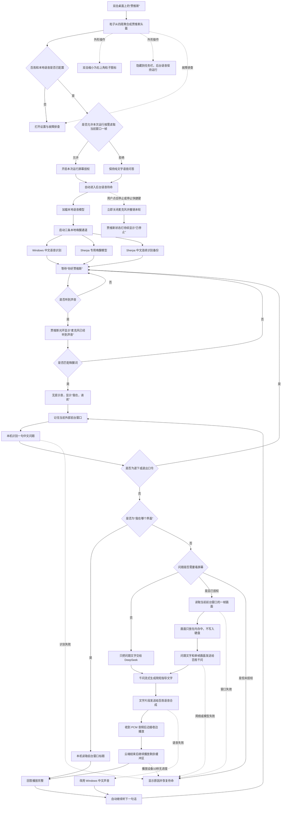

# 贾维斯完整工作流程

## 数据是否离开电脑

- 始终留在本机：唤醒词音频、问题语音、API Key、本次运行的屏幕授权状态。
- 普通问题只发送识别后的文字；屏幕问题在已授权时额外发送当前前台窗口的一帧。
- 云端返回：指导文字与合成后的回答音频。
- 不会进入 GitHub：API Key、真实截图、录音和个人运行数据。

## 当前能力边界

- 软件只观察并告诉用户下一步，不替用户点击、输入或移动鼠标。
- 每次只读取用户提问时正在使用的一个前台窗口，不读取整个桌面；切换软件后下次提问自动跟随。
- 目前一次唤醒识别一句问题；回答完成后再次说“你好贾维斯”进入下一轮。
